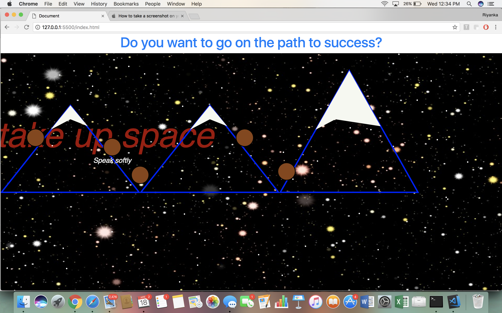
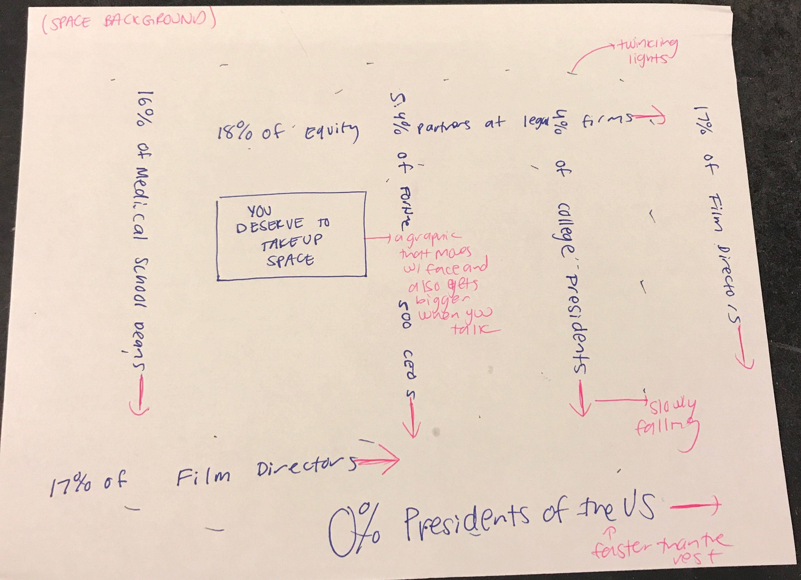

# Final Project- Interactive Graphics and Critical Code

Name:  Riyanka Ganguly

Date: April 20th, 2018

## Project: Take Up Space

### Conceptual Description

This project discusses the role that women play in the workplace. The concept of space is explored both literally and metaphorically, on multiple levels. Literally, the artwork is set in space with the background being of the stars in the universe. Additionally, in a world where "manspreading is the norm, taking up space also quite literally means not shrinking ourselves as women in public spaces. Metaphorically, this piece explores taking up space in different realms within the work place. The underlying message of the piece is that we as women deserve to take up space, whether that be literally in public settings or metaphorically in industries where women remain underrepresented. 

I hope for this piece to follow along the lines of the post-Cyberfeminism movement. Post-Cyberfeminism acknowledges the role that technology has played in both empowering and disadvantaging women and this balance is one I wish to focus on in my piece. I mean for this piece to empower the viewer but to also draw attention to the fact that there is much progress to be made in order to achieve equality. I hope the viewer will consider the professional power structures in play that create the need for us to consciously take up space. 


### Interaction Description

When the user moves their face, a sign saying "You deserve to take up space" will also be moving with them. When they speak, the image will start increasing in size, to quite literally show a taking up of space. The goal is to show that using your voice and attempting to be heard is an act of taking up space. All you have to do in order to take up space is start moving and advocating for yourself. As you speak however data on women in the workplace will move across the screen, and that is something you cant control. However, just because you cant control that doesnt mean it comes in teh way of you taking up space, and I convey that message quite literally by the fact that if you talk enough and take up enough space, the image will overpower the statistics. 

 My intended audience are those part of the post-Cyberfeminist movement, so both female identifying and gender non conforming folks. In order to see progress in these areas of the workplace, we need to unite as all women. 


### Extension 

All my pieces have built upon each other this semester, and I have continuously played with the concept of space. I am hoping to incorporate the data that I used in one of my projects- the data on women in the work place. I hope to also use moving text as I did in one of my projects. I am taking away the mountains and the planets and just focusing on the words themselves since my background is enough to create the feeling that the setting of this artwork is in a galaxy far away, in space. 

I am also building off my piece that had the You Deserve to Take up Space words move around with the face, but instead using a graphic image of that message to be cleaner. Basically, I will be combining two projects to create my final project- this time hopefully driving home the clarity of my message.




### Drawing or Sketch of Extended Piece



### Technical Details
//   
* Libraries- p5.js, bridge.js, FaceOSC, p5.sound
* Hosting Platform - Github Pages
* Given that I have never coded before this class, I feel that I will be able to do the best job if I stick to p5.js. However I would also like to include a background speech by Chimamanda Ngozi Adichie about taking up space for the viewer to hear, and for that I will experiment with p5.sound for the same time. I am using bridge.js to work with FaceOSC and continue my piece from the last project.

//

The following will be my code for moving my message when the viewer's mouth moves, and also my code for adding sound. 
	

```js
var song;

functions setup(){
    //will include much more, but just a start//
    function setup() {
  song = loadSound('');
  createCanvas(windowWidth, windowHeight);

}

}

function draw(){
var mouth= map(mouthHeight, 1, 5, 10, 200);
	console.log(mouth);
	fill(random(0, 255), 0, random(0, 255));

	textSize(mouth);
text('You Deserve to Take Up Space', position.x, position.y);

function mousePressed() {
  if ( song.isPlaying() ) { // .isPlaying() returns a boolean
    song.stop();
    background(255,0,0);
  } else {
    song.play();
    background(0,255,0);
  }
}

}
```

Link to your project's full code in this repository:  
https://riyankag.github.io/Final-Project/.